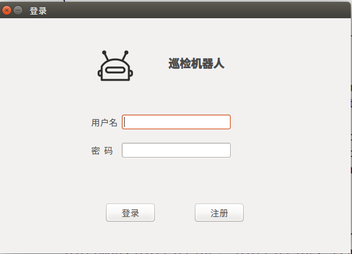
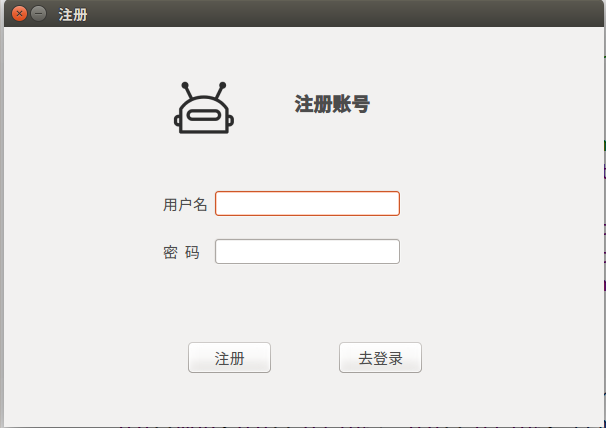
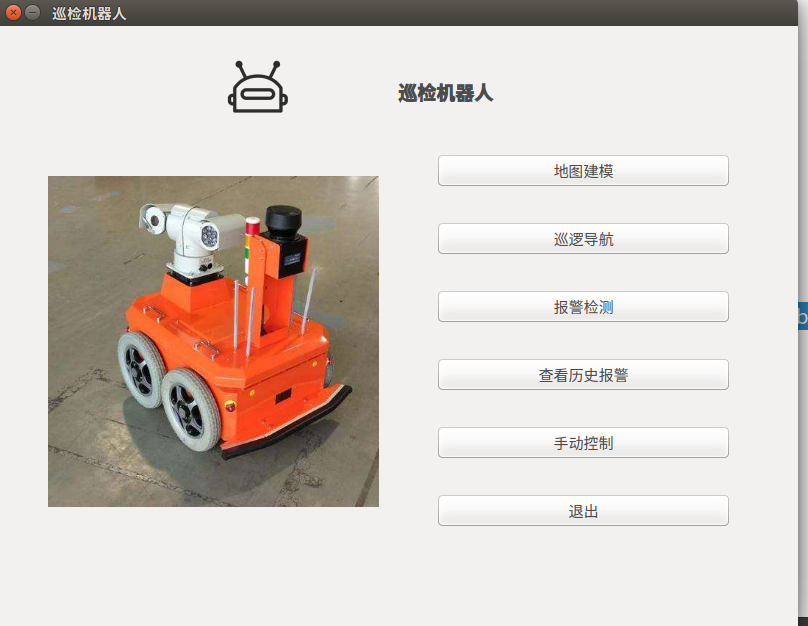
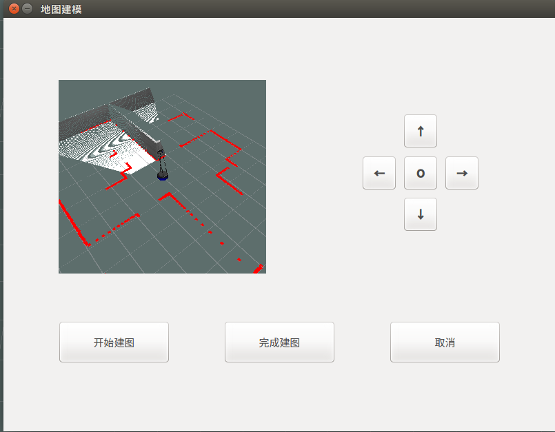
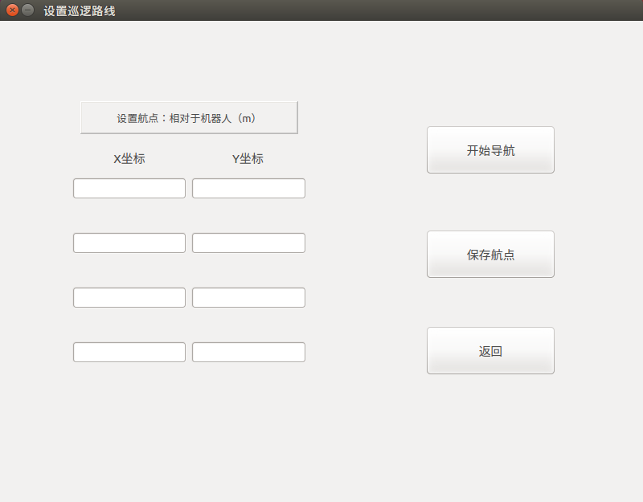
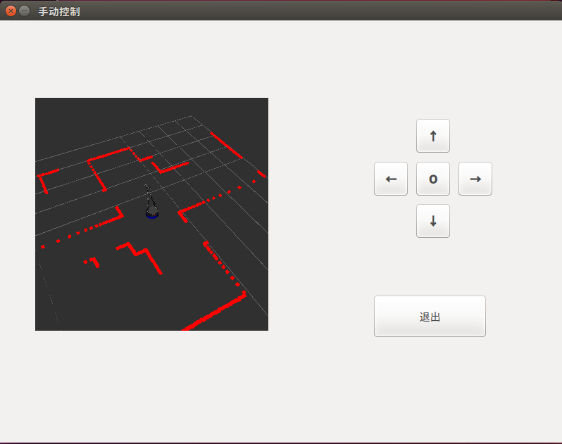
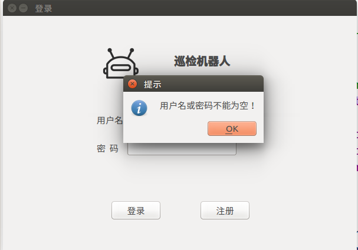

# 巡检机器人

这是一个巡检机器人，其主要功能是在商场社区等地进行巡逻，发现入侵人员或火情时，会发出警报，并将报警信息保存在本地。

## 实现功能

### 地图建模

通过用手推或手柄控制或按键和按钮控制等方式控制机器人遍历场景。

机器人通过摄像头等传感器获取地图信息。

机器人根据获取的地图信息进行实时建模，并在机载电脑上显示。

### 设置巡逻路线

通过输入坐标设置巡逻点。

保存路线。

打开运动按钮，机器人即可按照设定的路线开始巡逻。

### 登录注册

使用sqlite数据库实现了登录和注册的功能。

便于不同的用户使用。

### 自动避障

机器人在巡逻过程中在遇到障碍物时，能够实时自动建图，从而避开障碍物。

### 图像识别与报警

利用机器人的摄像头，实现了人脸检测功能和火警识别功能。

当识别到人脸或火警时，前端页面上会弹出警报信息，机器人发出警报提示音，同时将报警信息如类型、时间和坐标保存在本地。

可以查看历史报警信息。

### 手动操控

通过手柄或按钮手动控制机器人运动。

## 环境

### 软件环境

`Ubuntu 16.04 LTS`

`ROS Kinetic`

`Qt`

`SQLite数据库`

### 开发环境

`Visual Studio Code`

`Qt Creator`

### 硬件环境

系统实现所用的机器人是`Turtlebot2`，采用其固有的`Kuboki`底盘，搭载`Kinect2`深度相机以及`Rplidar`二维激光雷达。

## 使用方法

安装好系统后，使用ROS launch 运行相应的包

```shell
roslaunch ui_pkg ui.launch
```

## 文档说明

文档所参照的标准为国标GB8567-2006计算机软件文档编制规范。

主要有以下文档：

软件开发计划(SDP) 

软件需求规格说明(SRS)

软件设计说明(SDD)

软件测试说明(STD) 

软件测试报告(STR) 

## 图片展示

登录



注册



主界面



地图建模



设置巡逻路线



手动控制



提示



